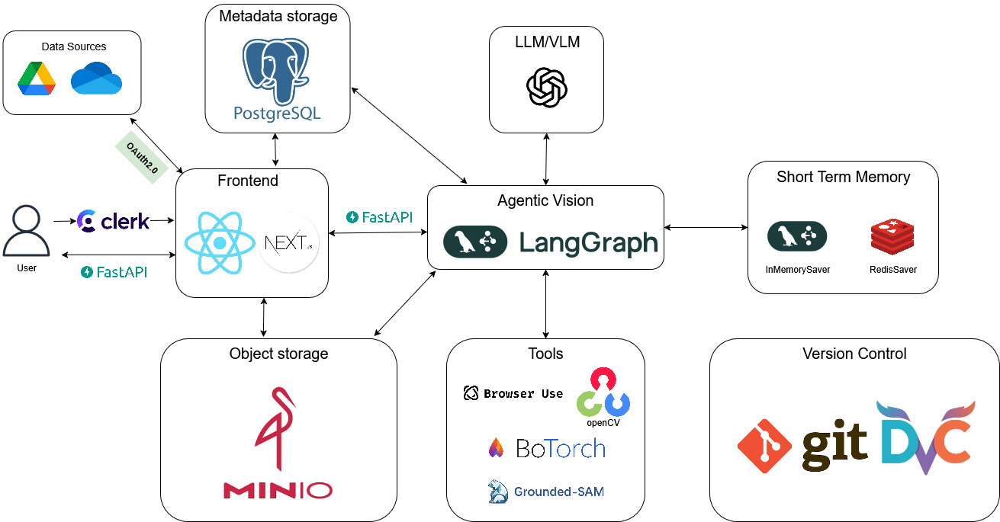

<p align="center">
  <h1 align="center">AgenticVision Web UI</h1>
  <p align="center">
    <a href="https://react.dev/" target="_blank">
      
    </a>
    <a href="https://nodejs.org/" target="_blank">
      
    </a>
    <a href="https://pnpm.io/" target="_blank">
      
    </a>
    <a href="https://nextjs.org/" target="_blank">
      
    </a>
  </p>
</p>

**The default Web UI for [AgenticVision](https://github.com/AI-DA-STC/generative-ai-agentic-cv-base.git).**

## Tech stack




## Quick Start

### Prerequisites

- [AgenticVision](https://github.com/AI-DA-STC/generative-ai-agentic-cv-base.git)
- Node.js (v22.14.0+)
- pnpm (v10.6.2+) as package manager
- minio as object storage
- clerk and Oauth2 for authentication
- postgres for metadata storage

### Configuration

Create a `.env` file in the project root and configure the following environment variables:

- `NEXT_PUBLIC_API_URL`: The URL of the API.
- `CLERK_SECRET_KEY`: Clerk authentication secret key.  
- `DATABASE_URL`: Database connection string.  
- `AWS_ACCESS_KEY_ID` / `AWS_SECRET_ACCESS_KEY`: AWS credentials for S3 storage. In my case, I used minio as my object storage.  
- `AWS_ENDPOINT_URL`: Custom endpoint for AWS S3-compatible storage.  
- `AWS_BUCKET_NAME`: Name of the S3 bucket for uploads.  
- `GOOGLE_CLIENT_ID` / `GOOGLE_CLIENT_SECRET`: Google OAuth credentials.  
- `NEXT_PUBLIC_GOOGLE_API_KEY`: Public Google API key for client-side use.  
- `SLACK_CLIENT_ID` / `SLACK_CLIENT_SECRET`: Slack OAuth credentials.  
- `GITHUB_CLIENT_ID` / `GITHUB_CLIENT_SECRET`: GitHub OAuth credentials.  


It's always a good idea to start with the given example file, and edit the `.env` file with your own values:

```bash
cp .env.example .env
```

### Installation

**IMPORTANT: First, **start the Python server**, see [AgenticVision](https://github.com/AI-DA-STC/generative-ai-agentic-cv-base.git) for more details.**

```bash
# Clone the repository
git clone https://github.com/krishna22112023/generative-ai-agentic-cv-frontend
cd generative-ai-agentic-cv-frontend

# Install dependencies
pnpm install

# Run the project in development mode
pnpm dev
```

Then open your browser and navigate to http://localhost:3000

Have fun!

## Docker

You can also run this project with Docker.

First, you need read the [configuration](#configuration) below. Make sure `.env` file is ready.

Second, to build a Docker image of your own web server:

```bash
docker build --build-arg NEXT_PUBLIC_API_URL=YOUR_API -t generative-ai-agentic-cv-frontend .
```

Final, start up a docker container running the web server:

```bash
# Replace generative-ai-agentic-cv-frontend-app with your preferred container name
docker run -d -t -p 3000:3000 --env-file .env --name generative-ai-agentic-cv-frontend-app generative-ai-agentic-cv-frontend

# stop the server
docker stop generative-ai-agentic-cv-frontend
```

### Docker Compose

You can also setup this project with the docker compose:

```bash
# building docker image
docker compose build

# start the server
docker compose up
```

### Acknowledgements 

This repo is inspired from [langmanus/langmanus-web-ui](https://github.com/Darwin-lfl/langmanus.git).